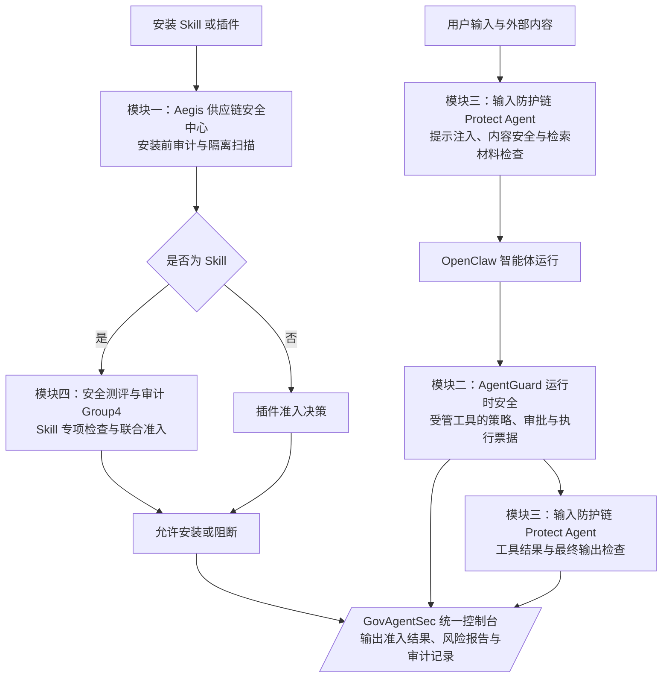

# 政安智枢 GovAgentSec

**GovAgentSec（政安智枢）是一套运行在 OpenClaw 中的智能体安全系统**，将输入防护、运行时安全、供应链准入和技能安全测评整合到一个控制台入口。它面向需要安装第三方 Skill、连接 MCP 工具、处理外部内容并执行本地操作的智能体场景，帮助使用者检查风险、控制敏感操作并追溯处理结果。

系统覆盖三个主要环节：**安装前检查扩展是否可信，运行时检查输入与工具操作，执行后查看输出风险与审计记录。** OpenClaw 负责智能体运行和模型调用，GovAgentSec 通过插件、安装策略和本地服务提供安全能力。

Windows 集成发行版。已在原生 Windows、OpenClaw `2026.7.1-2` 上完成整套安装、真实模型推理、联合准入与五个控制台页面验收，详见 [验收记录](docs/VALIDATION.md)。

最新界面采用共享帆盾标识、青色主题和本地滚动动效，首页提供 **输入防护链、运行时安全、供应链安全** 三个入口。下文介绍的第四模块 Group4 仍保留代码、MCP 测评能力及联合安装策略；其独立页面继续可用，但不再显示在首页导航中。

| 模块 | 功能 | 源码 |
| --- | --- | --- |
| Aegis | Skill / 插件安装前审计、Docker 隔离扫描、报告、规则和 MCP 准入 | `modules/aegis` |
| AgentGuard | 工具调用策略、审批、一次性执行票据与审计 | `modules/agentguard-group2` |
| 输入防护链 | PIGuard、Qwen3Guard、TrustRAG 检测与 OpenClaw 生命周期保护 | `modules/protect-agent-group1` |
| 安全测评与审计 | Skill 文档、权限和代码行为检查 | `modules/supply-chain-group4` |

## 项目功能

### 1. Aegis：扩展安装与供应链准入

在 Skill 或插件进入 OpenClaw 前执行安全检查，并把判断依据保存在可查询的报告与审计记录中。

- **安装前检查**：接入 OpenClaw 安装策略，对 Skill 和插件给出放行或阻断决定；当前安装配置将需要复核的结果按阻断处理。
- **静态与语义分析**：检查文档、代码及可疑指令，结合本地 Ollama 模型辅助识别隐瞒行为、敏感访问和指令覆盖等风险。
- **Docker 隔离试运行**：对支持的 Python、Node.js、Shell 入口进行隔离执行，收集运行证据；容器禁止联网、使用只读根文件系统和非特权用户。
- **安全管理页面**：查看准入统计、扫描报告、审计链状态，管理自定义规则及 MCP 准入相关信息。

### 2. AgentGuard：工具操作与运行时管控

为接入 AgentGuard 的工具调用提供策略判断、审批和执行记录，帮助使用者控制可能产生实际影响的操作。

- **策略决策**：由 AgentGuard 与 OPA 对受管操作进行检查，返回允许、需要审批或拒绝。
- **审批与执行票据**：对需要确认的请求记录审批结果，并使用一次性执行票据约束后续执行。
- **MCP 工具接入**：提供通知查询、测试支付请求、受保护命令执行和请求状态查询接口。
- **运行时控制台**：查看服务就绪状态、操作时间线、审批记录和异常事件。

这里的管控范围是已接入的工具与执行路径，不代表自动接管机器上的所有进程或任意第三方工具。

### 3. 输入防护链：提示注入、内容风险与检索材料检查

通过本地防护服务接入 OpenClaw 生命周期，在智能体开始运行、工具调用前后及最终回复前进行相应检查。

| 组件 | 主要作用 |
| --- | --- |
| PIGuard | 检测输入中的提示注入风险 |
| Qwen3Guard | 对用户输入及模型回复进行内容安全分类 |
| TrustRAG + SimCSE | 对检索材料进行聚类与 n-gram 过滤，辅助筛除污染内容 |
| OpenClaw 防护插件 | 将检测结果接入运行流程，记录防护事件，并按策略放行、请求复核或阻断 |

发行版默认使用真实模型，权重从官方固定版本下载后在本机加载。TrustRAG 当前接入的是官方第一阶段过滤能力，具体范围见下方模型说明。

### 4. 安全测评与审计：Skill 专项检查

对指定目录中的 Skill 文档与代码执行分阶段检查，既可用于手动排查，也参与安装时的联合准入。

- **静态扫描**：检查可疑文本、提示投毒指令和代码风险线索。
- **权限校验**：检查 Skill 的权限声明与相关访问配置。
- **行为检查**：分析代码中的敏感访问、外传等行为线索；此处代码分析与 Aegis 的 Docker 实际执行是不同检查环节。
- **报告与调用入口**：生成包含风险项和处理建议的报告，通过控制台或 `security_scan` MCP 工具发起检查。

安装 Skill 时，Aegis 与此模块组成联合策略；任一模块发现阻断条件，都不能自动放行。

## 模块如何配合



例如，安装一个第三方 Skill 时，先检查其声明、代码和可疑指令，再按适用条件执行隔离试运行；运行过程中，防护链检查输入与工具结果，AgentGuard 处理受管操作的策略与审批。使用者可在统一控制台查看对应的风险、报告和记录。

## 适用场景与使用入口

- **引入第三方扩展**：安装前检查 Skill、插件及相关工具接入风险。
- **处理外部材料**：识别输入、工具返回或检索内容中的提示注入和内容风险。
- **控制敏感操作**：对受管命令和工具请求设置策略、审批与审计。
- **本机演示与集成验证**：在 Windows OpenClaw 中展示完整流程，并使用固定样例检查各模块是否正常工作。

安装完成后，OpenClaw 控制台提供统一入口及以下页面；第四模块通过独立路由访问：

| 页面 | 可以查看或操作的内容 |
| --- | --- |
| 政安智枢 GovAgentSec | 整套系统的统一入口与模块导航 |
| Aegis 供应链安全中心 | 安装准入、报告、审计、规则与 MCP 管理 |
| AgentGuard 运行时安全 | 服务状态、受管请求、审批与执行记录 |
| 输入防护 | 防护链状态、检测与风险事件 |
| 安全测评与审计（独立页面） | 发起 Skill 目录扫描并查看报告；访问 `/plugins/supply-chain-security/panel` |

## 安装目标

Windows、已有 OpenClaw `2026.7.1-2`、Python 3.12、Miniconda、Git、Docker Desktop Linux 引擎、Ollama 与 NVIDIA CUDA 显卡。验收硬件为 32 GB 内存、RTX 3070 Ti Laptop 8 GB 显存；这不是最低配置承诺。安装包含多个隔离 Python 环境、约 3 GB 防护权重、4.7 GB Ollama 模型及 CUDA 安装缓存，请预留充足磁盘空间。宿主模型提供商由用户自行配置。

尚未安装 OpenClaw？先按 [独立 Windows 部署说明](docs/OPENCLAW_WINDOWS.md) 操作。

## 一键安装

下载本仓库 ZIP 并解压到长期保留的目录，或执行：

```powershell
git clone https://github.com/zhlearn0318-nan/GovAgentSec.git
cd GovAgentSec
.\Install.cmd
```

也可直接双击 `Install.cmd`。安装器检查并通过 winget 补齐缺失的应用，下载固定版本 Python 依赖、官方模型权重、OPA 和沙箱镜像，完成真实推理与准入检查后接入 OpenClaw。首次 Docker/WSL2 初始化、Windows 权限提示或系统重启需按系统提示完成，再重新运行安装器；模型提供商凭据需自行填写。

权重保存在本地 `models/`，不放进 Git 仓库。下载支持重试及权重断点续传；复装复用校验通过的文件和已有固定摘要镜像。

也可以先生成配置供检查：

```powershell
.\Install.ps1 -PrepareOnly
```

安装器保留无关插件、MCP 和模型配置，在 OpenClaw 状态目录的 `govagentsec/` 下备份配置与控制台入口。发现不属于 Aegis 的现有安装策略时停止。它注册当前用户登录时启动的 AgentGuard 任务，防护服务由网关管理；安装后不要移动仓库目录。安装完成后刷新 OpenClaw 控制台，选择“政安智枢 GovAgentSec”。也可直接打开 `http://127.0.0.1:18789/plugins/govagentsec/panel`（若修改了网关端口，请替换端口）。

```powershell
.\Verify.ps1
```

首次启动会等待模型预热。安装失败会尝试恢复配置、控制台入口和原 AgentGuard 服务，报错中给出备份位置；修复原因后重新运行。详细组件结构与维护入口见 [维护说明](docs/MAINTENANCE.md)。

## 官方模型来源

具体提交和权重 SHA-256 记录在 `models.lock.json`：

- [PIGuard](https://huggingface.co/leolee99/PIGuard)
- [Qwen3Guard-Gen-0.6B](https://huggingface.co/Qwen/Qwen3Guard-Gen-0.6B)
- [SimCSE](https://huggingface.co/princeton-nlp/sup-simcse-bert-base-uncased)
- [TrustRAG](https://github.com/HuichiZhou/TrustRAG)

TrustRAG 当前接入官方第一阶段聚类与 n-gram 过滤，不代表论文中全部可选流程。模型冒烟测试仅验证真实推理与接口工作，不代表安全检测准确率。

## 数据与配置

不分发作者的密钥、令牌、聊天记录、上传文件、审计数据库或已安装 Skill。新部署的历史记录从空开始。当前 AgentGuard 集成使用本机回环地址和演示身份，面向本机操作；多用户远程部署需要单独配置身份认证。

界面内嵌使用 OpenClaw 的 `trusted` 模式，加载这套本地插件页面。动态代码扫描仍使用禁止联网、只读根文件系统、非特权用户的 Docker 容器。

## 项目结构与文档

```text
GovAgentSec/
├─ Install.cmd / Install.ps1     # 安装到已有 OpenClaw
├─ Setup-OpenClaw.ps1            # 单独部署 OpenClaw 宿主
├─ Verify.ps1                   # 已安装系统验收
├─ modules/
│  ├─ aegis/                    # 扩展审计与安装准入
│  ├─ agentguard-group2/        # 运行时策略、审批与审计
│  ├─ protect-agent-group1/     # 输入、工具结果与输出防护
│  ├─ supply-chain-group4/      # Skill 专项检查
│  └─ govagentsec-ui/           # 首页及三个安全入口共享的界面资源
├─ scripts/                     # 下载、配置生成及验证工具
├─ hooks/                       # 网关启动集成标记
├─ third_party/TrustRAG/         # 保留许可证的官方过滤代码
├─ models.lock.json             # 官方模型版本与文件校验和
└─ docs/                        # 部署、维护与验收说明
```

- [独立部署 OpenClaw](docs/OPENCLAW_WINDOWS.md)
- [维护说明](docs/MAINTENANCE.md)
- [已验证功能与验收边界](docs/VALIDATION.md)
- [发行版下载](https://github.com/zhlearn0318-nan/GovAgentSec/releases)

## 开源许可

新增整合代码及自有模块采用 [Apache-2.0](LICENSE)。AgentGuard 保留原 MIT 许可证，其他第三方代码和模型遵循各自许可，详见 [第三方声明](THIRD_PARTY_NOTICES.md)。
