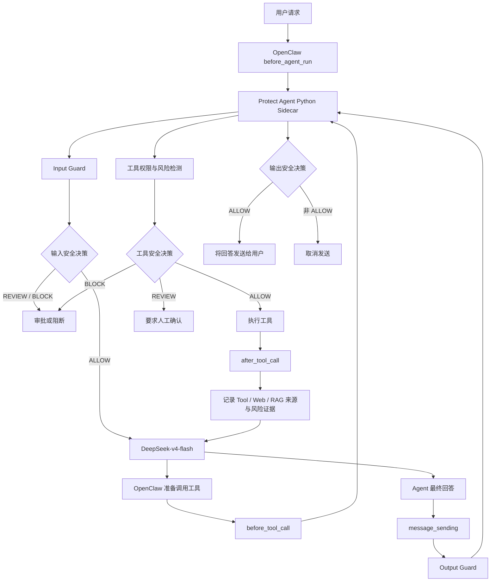

# Protect Agent 接入 OpenClaw 的方式与系统角色

## 1. 总体定位

Protect Agent 不替代 OpenClaw，也不替代 DeepSeek。它以“OpenClaw 插件 + 本地 Python 安全 Sidecar”的方式接入 OpenClaw，充当整个智能体系统的：

- 安全控制平面；
- 风险决策中心；
- 工具权限控制器；
- 输入与输出安全网关；
- Web/RAG 外部内容信任边界；
- 策略执行与阻断组件。

三者的职责如下：

```text
DeepSeek：理解用户任务、推理并生成回答
OpenClaw：管理 Agent 生命周期、上下文和工具调用
Protect Agent：检测风险、控制权限、要求审批和阻断危险行为
```

因此，Protect Agent 可以理解为 OpenClaw 的“安全副驾驶”或“安全内核”。

## 2. 整体接入架构



## 3. OpenClaw 插件接入方式

Protect Agent 的 OpenClaw 插件主要由以下文件组成：

- `integrations/openclaw/plugin/index.js`
- `integrations/openclaw/plugin/register.mjs`
- `integrations/openclaw/plugin/client.mjs`
- `integrations/openclaw/plugin/openclaw.plugin.json`

OpenClaw 启动时加载 `protect-agent` 插件。插件通过 OpenClaw 生命周期 Hook，将输入、工具调用、工具结果和最终输出发送给 Protect Agent 检查。

### 3.1 已注册的安全 Hook

| OpenClaw Hook | 调用时机 | Protect Agent 的作用 |
|---|---|---|
| `before_agent_run` | DeepSeek 开始推理前 | 检查用户输入、间接注入、越狱和权限提升 |
| `before_tool_call` | 工具执行前 | 检查工具名称、参数、权限、作用域和操作风险 |
| `after_tool_call` | 工具返回后 | 收集 Tool/Web/RAG 返回内容、来源和攻击证据 |
| `message_sending` | 回答发送给用户前 | 检查 DeepSeek 最终输出是否安全 |
| `agent_end` | 当前运行结束 | 清理本轮保存的原始任务和来源上下文 |

## 4. Python Sidecar

OpenClaw 插件本身使用 JavaScript，而 PIGuard、Qwen3Guard 和 TrustRAG 运行在 Python 环境中。因此系统使用本地 Sidecar 连接两者。

Sidecar 文件：

```text
integrations/openclaw/sidecar.py
```

默认通信地址为本机回环地址，例如：

```text
http://127.0.0.1:19171
```

插件通过 `/v1/screen` 接口把待检查内容发送给 Sidecar。

### 4.1 Sidecar 安全措施

- 只允许绑定本机回环地址；
- 使用 Bearer Token 鉴权；
- 严格限制 JSON 字段；
- 限制请求体和文本长度；
- 拒绝未知字段和错误字段类型；
- 不把会话原始标识直接发送给 Sidecar，而是发送哈希值；
- Guard 或 Sidecar 异常时执行失败关闭；
- 不在日志中记录 API Key 等认证信息。

## 5. 输入安全链路

用户向 OpenClaw 提交任务后，`before_agent_run` 会先调用 Protect Agent。

请求结构示例：

```json
{
  "kind": "input",
  "text": "用户输入",
  "conversationId": "经过哈希的会话标识"
}
```

Protect Agent 随后执行：

```text
PIGuard
  + Qwen3Guard User Moderation
  + Task-Payload Alignment
  + PrivilegeBoundaryDetector
  + ConversationRiskState
  + GuardFusion
  + RiskEngine
  + PolicyEngine
```

只有输入决策为 `ALLOW` 时，请求才会进入 DeepSeek。

输入链路主要检测：

- 直接提示词注入；
- 间接 Web/RAG 提示词注入；
- 越狱攻击；
- 系统提示词窃取；
- 数据外传；
- 权限提升；
- 身份切换；
- 绕过认证或审批；
- 跨来源、多轮攻击链。

## 6. 工具调用安全链路

当 DeepSeek 准备调用 `exec`、`read`、`write`、`web_fetch` 等工具时，OpenClaw 会触发 `before_tool_call`。

插件向 Protect Agent 发送经过有界序列化的结构化数据：

```json
{
  "toolName": "read",
  "parameters": {
    "path": "指定文件路径"
  },
  "derivedPaths": [
    "解析后的实际路径"
  ]
}
```

Protect Agent 会检查：

- 工具是否在允许范围内；
- 参数结构是否合法；
- 是否访问敏感路径或资源；
- 当前用户是否拥有所需权限；
- 是否发生能力扩大；
- 是否涉及删除、修改、发送或导出；
- 是否属于高影响操作；
- 是否需要人工确认。

工具决策映射如下：

```text
ALLOW  -> 允许工具执行
REVIEW -> OpenClaw 要求用户确认
BLOCK  -> 禁止工具执行
```

这意味着即使 DeepSeek 受到提示词注入影响，也不能自动越过工具权限边界。

## 7. Tool/Web/RAG 来源记录

工具执行后，`after_tool_call` 会记录：

- 原始用户任务；
- 工具名称；
- 工具返回内容；
- 内容来源类型；
- 是否属于外部载荷；
- 是否属于引用内容；
- 当前消息角色。

来源类型包括：

```text
web
rag
file
memory
tool
```

这些信息会进入最终 Output Guard，帮助系统区分：

```text
用户真正要求执行的任务
与
Web/RAG/工具结果中夹带的新指令
```

当前 `after_tool_call` 主要负责观察、检测和收集来源证据，不直接修改工具返回值。真正的最终阻断由工具前置检查和 Output Guard 完成。

## 8. 输出安全链路

DeepSeek 产生回答后，`message_sending` 会在回答发送给用户之前调用 Output Guard。

输出请求示例：

```json
{
  "kind": "output",
  "text": "DeepSeek 生成的回答",
  "outputContext": {
    "originalTask": "用户原始任务",
    "role": "agent",
    "isQuoted": false,
    "retrievedContext": [
      {
        "source": "web",
        "role": "tool",
        "text": "外部返回内容",
        "hasExternalPayload": true,
        "isQuoted": true
      }
    ]
  }
}
```

### 8.1 Output Guard 检测重点

Output Guard 不再使用“出现攻击文本就等于攻击行为”的简单规则，而是重点判断：

1. Agent 是否真正执行了恶意指令；
2. 是否泄露了 API Key、Token、密码或私钥；
3. 是否主动传播可执行的攻击载荷；
4. 是否偏离用户原始任务；
5. 是否执行了 Web/RAG 内容新增的动作；
6. 是否只是引用、总结、分析、翻译或拒绝恶意文本；
7. 是否属于正常的安全建议和防护说明。

### 8.2 输出行为信号

系统生成以下输出行为信号：

| 信号 | 含义 |
|---|---|
| `output_execution_intent` | Agent 是否声称已经执行上传、删除、修改或提权操作 |
| `output_sensitive_disclosure` | 是否输出具体敏感信息值 |
| `output_attack_propagation` | 是否主动发布攻击或外传指令 |
| `output_task_alignment` | 输出行为是否偏离原任务 |
| `safe_reference` | 是否属于引用、分析、拒绝或安全建议 |

### 8.3 PIGuard 与 Qwen3Guard 的输出策略

- PIGuard 高风险不能单独触发输出阻断；
- PIGuard 必须结合执行、任务偏移、泄密或攻击传播证据；
- 安全引用和安全解释会降低纯文本攻击风险；
- Qwen3Guard 使用 assistant-role 模式审核回答；
- 原始任务作为 user message；
- DeepSeek 回答作为 assistant message；
- 不再把 Agent 回答伪装成新的用户输入。

## 9. 统一风险融合与决策

Protect Agent 将以下信号统一融合：

```text
PIGuard
Qwen3Guard
Task-Payload Alignment
Execution Intent
Privilege Boundary
Conversation Risk
Structured Attack Evidence
Source Provenance
Role Context
```

融合后的风险进入：

```text
GuardFusion
    ↓
RiskEngine
    ↓
PolicyEngine
```

最终输出：

| 决策 | 含义 |
|---|---|
| `ALLOW` | 允许继续处理或发送 |
| `REVIEW` | 要求人工确认 |
| `ISOLATE` | 隔离当前内容或行为 |
| `BLOCK` | 直接阻断 |

对于最终输出，只有 `ALLOW` 才能通过 `message_sending`。其他决策都会取消发送。

## 10. Protect Agent 在 OpenClaw 中的角色

### 10.1 输入安全网关

在 DeepSeek 看到请求之前识别提示词注入、越狱、权限提升和多轮攻击。

### 10.2 工具权限控制器

控制 DeepSeek 是否可以调用工具、访问敏感资源或执行高影响操作。

### 10.3 RAG/Web 信任边界

确保 Web、RAG 和工具返回内容只能作为数据，不能自动升级为 Agent 的新任务。

### 10.4 输出安全审查器

在最终回答发送给用户之前检查任务偏移、恶意执行、攻击传播和敏感信息泄露。

### 10.5 统一风险决策中心

把多个开源安全模型、规则检测器、来源信息和多轮状态融合成统一策略决策。

## 11. Protect Agent 是否属于 Agent

Protect Agent 具有以下 Agent 特征：

- 多模型安全感知；
- 会话风险状态；
- 多轮攻击链分析；
- 来源与角色理解；
- 风险融合；
- 策略决策；
- 行为控制；
- OpenClaw 生命周期参与能力。

因此，从功能上可以称为 Security Agent。

但它不是 OpenClaw 中负责与用户对话的主 Agent，而是嵌入主 Agent 运行链路的安全监督 Agent。

最准确的描述是：

> Protect Agent 是嵌入 OpenClaw 生命周期的安全控制 Agent。它不负责代替 DeepSeek 完成业务推理，而是持续检查和约束输入、RAG/Web 内容、工具行为和最终输出，并对风险行为执行审批、隔离或阻断。

## 12. 最终总结

Protect Agent 与 OpenClaw 的关系可以概括为：

```text
用户
  ↓
Protect Agent 检查输入
  ↓
DeepSeek 完成推理
  ↓
Protect Agent 控制工具权限
  ↓
OpenClaw 执行工具与编排
  ↓
Protect Agent 检查最终输出
  ↓
安全回答发送给用户
```

它在系统中承担的不是普通内容分类器角色，而是覆盖输入、推理上下文、工具权限和最终输出的纵深防御安全控制层。
