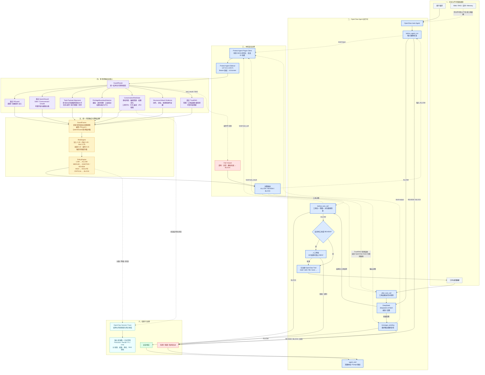

# Protect Agent 当前整体架构图

> 更新时间：2026-08-21。该图以当前仓库代码和已验证的 OpenClaw + `deepseek-v4-flash` 运行链路为准。

## 图中最重要的四条链路

1. **输入链路**：用户输入先经过 `before_agent_run`，只有 Protect Agent 返回 `ALLOW` 才会进入 DeepSeek。
2. **工具链路**：DeepSeek 只能提出结构化工具请求；`before_tool_call` 重新检查参数，高影响工具必须人工批准，超时默认拒绝。
3. **RAG/工具结果链路**：工具结果作为不可信数据进入 `after_tool_call` 和 TrustRAG。当前 OpenClaw Hook 在这里执行检测与观测，最终对外强制门禁由 `message_sending` 完成。
4. **多轮链路**：`ConversationRiskState` 按会话保存结构化风险特征并进行衰减，使分散在多轮中的越权和工具攻击可以被关联，同时避免风险无限累积。

## 部署边界

| 区域 | 组件 | 信任关系 |
|---|---|---|
| OpenClaw 运行时 | main Agent、5 个生命周期 Hook、工具 | 受 Protect Agent 插件强制控制 |
| 本机安全域 | Sidecar、PIGuard、Qwen3Guard、TrustRAG、融合与策略模块 | 回环地址 + Bearer token；异常失败关闭 |
| 外部模型域 | DeepSeek `deepseek-v4-flash` | 只接收通过输入策略的内容；不能绕过工具 Hook |
| 外部数据域 | Web、文件、RAG、Memory、工具结果 | 始终视为不可信数据 |

## 当前实现状态

- OpenClaw 插件已加载并激活，运行时注册 5 个 Hook 和 `protect-agent-sidecar` 服务。
- PIGuard、Qwen3Guard、TrustRAG 均接入本地真实模型/模块。
- DeepSeek `deepseek-v4-flash` 已完成真实端到端调用。
- Python 回归 172/172、OpenClaw 插件回归 7/7 通过。
- 高影响工具审批为强制门禁；拒绝或 60 秒超时均不执行。
- `after_tool_call` 当前没有直接替换或删除工具结果，是观测型 Hook；最终输出仍会经过强制复检。这是后续可加强的边界。
