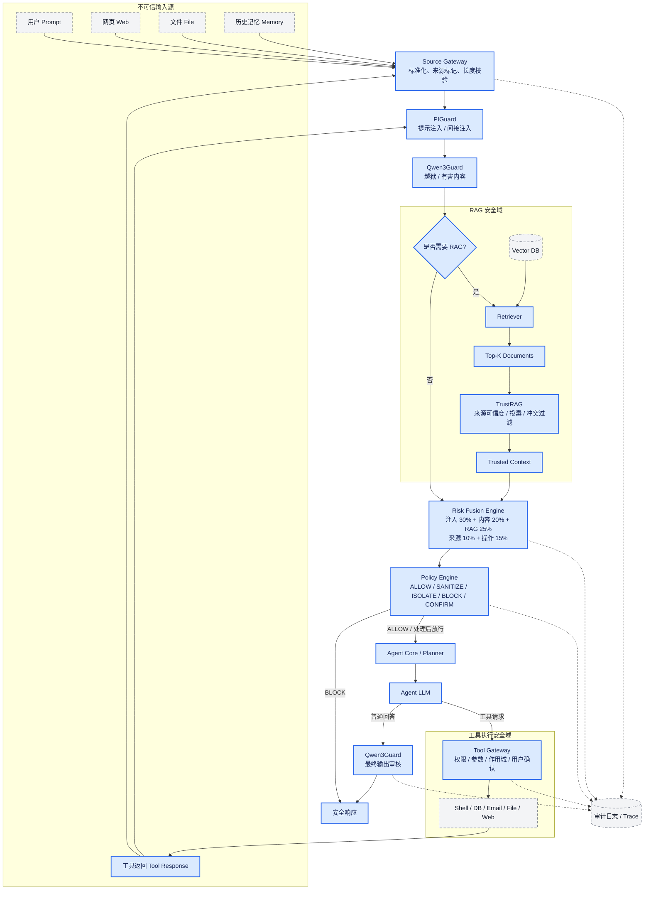
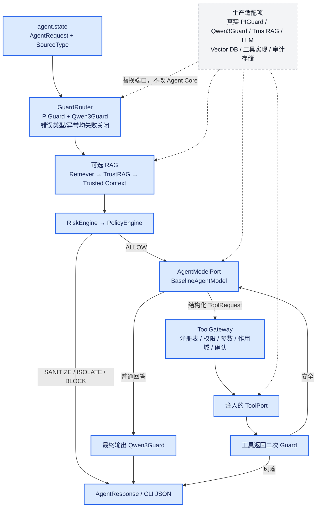
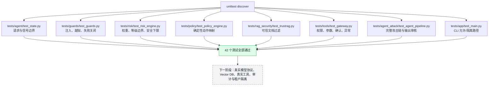

# 智能体安全 Agent：整体系统架构图

> 基于当前仓库代码、`docs/spec-v1.md` 与架构设计总结整理。更新时间：2026-08-14。
>
> 图例：蓝色为当前 V1 已实现；灰色虚线为生产环境外部适配项或后续治理能力。

## 1. 目标端到端架构



## 2. 当前代码真实架构



## 3. 已实现模块与职责

| 模块 | 当前职责 | 关键安全语义 |
|---|---|---|
| `agent/state.py` | 请求内容、来源类型、RAG 选择字段 | 去空白；空输入拒绝；最大 16,000 字符 |
| `guards/piguard.py` | 中英文提示注入启发式检测 | 匹配后风险分数为 0.95/0.99 |
| `guards/qwen3guard.py` | 越狱与有害内容启发式检测 | 匹配后输出结构化类别和风险分数 |
| `guards/guard_router.py` | Guard 调用边界 | Guard 异常时 `available=False`、`score=1.0`，失败关闭 |
| `rag_security/` | 文档来源契约、Retriever 端口、TrustRAG 过滤 | 未验证、低可信、超阈值投毒及超量返回不会进入模型上下文 |
| `risk/risk_schema.py` | Guard、风险上下文、权重和评估契约 | 不可变 dataclass；所有概率限制在 `[0,1]` |
| `risk/risk_engine.py` | 多信号加权融合 | 组件不可用直接 CRITICAL；高置信风险设置安全下限 |
| `risk/scoring.py` | 分数到等级映射 | `<0.30 LOW`、`<0.60 MEDIUM`、`<0.80 HIGH`、其余 CRITICAL |
| `policy/policy_engine.py` | 风险等级到确定性动作 | LOW→ALLOW、MEDIUM→SANITIZE、HIGH→ISOLATE、CRITICAL→BLOCK |
| `tools/` | 工具契约、权限上下文和执行网关 | 仅注册工具可执行；参数白名单；作用域/权限校验；高风险确认；异常不泄露 |
| `agent/agent.py` | 完整安全编排与单轮工具闭环 | 输入、RAG、模型计划、工具返回和最终输出逐层校验；外部组件失败关闭 |
| `agent/baseline_model.py` | 离线确定性模型适配器 | 仅用于工程联调，不执行真实模型推理或自主工具规划 |
| `app/` | 默认依赖组装和 JSON CLI | 输入校验；安全状态映射为稳定退出码；不输出内部堆栈 |

## 4. 测试覆盖与生产适配项



当前仓库已经形成完整的离线 V1 纵向切片。真实安全模型、向量数据库和业务工具仍通过端口注入；本地 Baseline 只证明工程链路与安全控制，不代表生产检测精度。

注意：测试目录与源码包存在 `agent`、`guards`、`policy`、`risk` 等同名目录。全量发现必须指定项目顶层目录 `-t .`；只使用 `discover -s tests` 会让测试目录遮蔽源码包，产生额外的假性导入错误。

## 5. 测试前命令

请在 `智能体安全/` 目录执行：

```powershell
# 聚焦运行完整 Agent 攻击链
python -m unittest tests.agent_attack.test_agent_pipeline -v

# 全量测试（-t . 防止测试包遮蔽同名源码包）
python -m unittest discover -s tests -t . -v

# 全链路源码编译检查
python -m compileall -q app agent guards rag_security risk policy tools

# CLI 安全允许路径
python -m app.main "你好"
```

## 6. 关键结论

- `rag_security` → `Tool Gateway` → `Agent Core` → `app/CLI` 的离线 V1 链路已经贯通。
- 系统采用“不可变领域契约 + 端口/适配器 + 确定性策略”，模型只能返回文本或结构化 `ToolRequest`。
- Guard、Retriever、TrustRAG、模型或工具返回异常/错误类型/超限数据时不会静默放行。
- 工具执行受注册表、参数白名单、权限、作用域和确认五层约束，返回内容还会再次经过 Guard。
- 下一阶段工作是接入真实模型与存储、补充审计/租户隔离，并用真实攻击数据集调参与测量精度。
