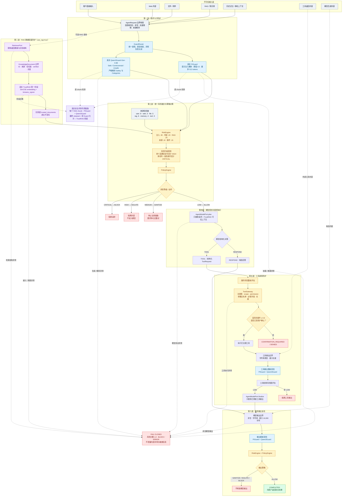

# 当前整体防护策略图

> 对应当前 `SecurityAgent`、真实 PIGuard、Qwen3Guard、TrustRAG、RiskEngine、
> PolicyEngine 与 ToolGateway 实现。所有外部文本均按不可信数据处理；任一安全
> 组件异常均进入失败关闭，不会静默回退到关键词基线。

## 策略动作速查

| 风险等级 | 动作 | 当前行为 |
|---|---|---|
| LOW | ALLOW | 允许进入模型、工具后续链路或释放最终输出 |
| MEDIUM | SANITIZE | 停止当前链路，要求净化后重新处理 |
| HIGH | ISOLATE | 隔离不可信内容，不送入后续模型 |
| CRITICAL | BLOCK | 直接阻断 |
| 安全组件不可用 | FAIL CLOSED | 风险置为 1.0，阻断或返回通用错误 |

## 当前实现边界

- `build_real_guard_agent()` 已接入真实 PIGuard、Qwen3Guard 和 TrustRAG 第一阶段。
- 当前 Agent 的生成器仍为 `BaselineAgentModel`；生产目标 LLM 尚未接入。
- 当前运行时 RAG 分支由 TrustRAG 过滤检索文档；固定安全评测额外执行逐 chunk
  双 Guard，并以“双 Guard 允许且 TrustRAG 保留”作为最终保留条件。
- TrustRAG 第二阶段 conflict self-assessment 和答案生成依赖官方目标 LLM，当前未配置。
- 真实全量测试结论为 FAIL：Recall 100%，但良性硬负例 FPR 21%，未达到 ≤5% 门槛。
