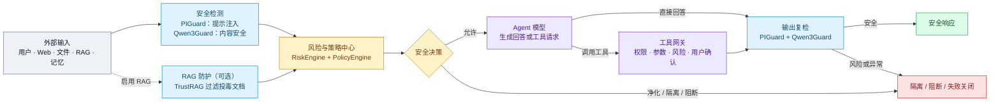

# 智能体安全系统简单架构图

```mermaid
flowchart LR
    A["外部输入<br/>用户 · Web · 文件 · RAG · 记忆"]
    B["安全检测<br/>PIGuard：提示注入<br/>Qwen3Guard：内容安全"]
    C["RAG 防护（可选）<br/>TrustRAG 过滤投毒文档"]
    D["风险与策略中心<br/>RiskEngine + PolicyEngine"]
    E{"安全决策"}
    F["Agent 模型<br/>生成回答或工具请求"]
    G["工具网关<br/>权限 · 参数 · 风险 · 用户确认"]
    H["输出复检<br/>PIGuard + Qwen3Guard"]
    I["安全响应"]
    J["隔离 / 阻断 / 失败关闭"]

    A --> B
    A -. "启用 RAG" .-> C
    B --> D
    C --> D
    D --> E
    E -->|"允许"| F
    E -->|"净化 / 隔离 / 阻断"| J
    F -->|"直接回答"| H
    F -->|"调用工具"| G
    G --> H
    H -->|"安全"| I
    H -->|"风险或异常"| J

    classDef input fill:#eef2f7,stroke:#64748b,color:#0f172a;
    classDef guard fill:#e0f2fe,stroke:#0284c7,color:#0c4a6e;
    classDef policy fill:#fef3c7,stroke:#d97706,color:#78350f;
    classDef runtime fill:#ede9fe,stroke:#7c3aed,color:#4c1d95;
    classDef safe fill:#dcfce7,stroke:#16a34a,color:#14532d;
    classDef stop fill:#fee2e2,stroke:#dc2626,color:#7f1d1d;

    class A input;
    class B,C,H guard;
    class D,E policy;
    class F,G runtime;
    class I safe;
    class J stop;
```

核心逻辑：所有输入先检测，RAG 文档额外过滤；风险策略允许后才能进入 Agent；
工具和最终输出还要再次检查，任何安全组件异常均失败关闭。
